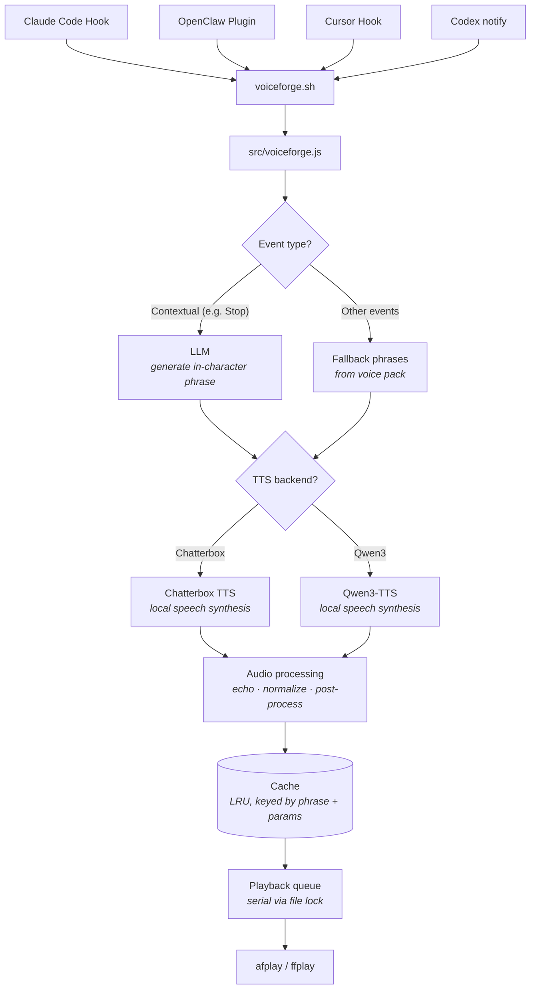

<p align="center">
  <a href="https://youtu.be/-aiSZnGNyE4">
    
  </a>
</p>

# VoiceForge

LLM-generated voice notifications for [Claude Code](https://docs.anthropic.com/en/docs/claude-code), [Cursor](https://cursor.com/docs/agent/hooks), [OpenAI Codex](https://developers.openai.com/codex/), and [OpenClaw](https://openclaw.dev), spoken by game characters like the StarCraft Adjutant, Kerrigan, C&C EVA, SHODAN, and more.

### Why VoiceForge?

Existing notification chimes (like [peon-ping](https://github.com/PeonPing/peon-ping)) do a great job of telling you *when* something happened — a task finished, an error occurred. But when you've got half a dozen coding agent windows running at once, a simple ding doesn't tell you *what* just happened or *which* session needs your attention. You end up alt-tabbing through windows trying to figure out who's waiting on you.

VoiceForge fixes that. Each session speaks to you in a distinct character voice — each with its own personality, tone, and vocabulary — so you hear *"Query efficiency restored to nominal"* from the clinical HEV Suit in one window and *"Pathetic test suite for code validation processed"* from a contemptuous SHODAN in another, and you instantly know what's going on. And because phrases are generated by an LLM rather than pulled from a fixed list, you won't hear the same line on repeat until you want to throw your speakers out the window.


## Voices

| | Pack ID | Voice | Source | Status |
|---|---------|-------|--------|--------|
|  | `sc1-adjutant` | **SC1 Adjutant** | StarCraft | ✅ Available |
|  | `sc2-adjutant` | **SC2 Adjutant** | StarCraft II | ✅ Available |
|  | `red-alert-eva` | **EVA** | Command & Conquer: Red Alert | ✅ Available |
|  | `sc1-kerrigan` | **SC1 Kerrigan** | StarCraft | ✅ Available |
|  | `sc2-kerrigan` | **SC2 Kerrigan** | StarCraft II | ✅ Available |
|  | `sc1-protoss-advisor` | **Protoss Advisor** | StarCraft | ✅ Available |
|  | `ss1-shodan` | **SHODAN** | System Shock | ✅ Available |
|  | `hl-hev-suit` | **HEV Suit** | Half-Life | ✅ Available |


**More coming soon** — [Request a voice](https://github.com/settinghead/voiceforge/issues/new?title=Voice+request%3A+%5BCharacter+Name%5D&body=**Character%3A**+%0A**Game%2FSource%3A**+%0A**Why%3A**+)

```bash
voiceforge voice    # interactive picker
```

## How It Works



1. A hook event fires (from Claude Code, Cursor, Codex notify, or OpenClaw via plugin) — `voiceforge.sh` or `voiceforge cursor-hook` or `voiceforge codex-notify` (or the OpenClaw plugin) passes it to `src/voiceforge.js`
2. The event is mapped to a category and the active voice pack is loaded
3. Contextual events (e.g. task completion) send context to the configured LLM, which generates a short in-character phrase; other events use predefined fallback phrases from the pack
4. The phrase is sent to the configured TTS backend (Chatterbox or Qwen3-TTS) for local speech synthesis with per-pack voice cloning parameters
5. The resulting audio is post-processed (optional pitch/tempo), echo-filtered, and volume-normalized (sox)
6. Processed audio is cached on disk — repeated phrases play instantly from cache
7. A file-based queue with lock ensures serial playback across concurrent hook events

## Prerequisites

Install these **before** running the Quick Install below:

| Aspect | macOS | Windows | Linux |
|--------|-------|---------|-------|
| **Node.js 18+** | [nodejs.org](https://nodejs.org) or `brew install node` | [nodejs.org](https://nodejs.org) or `winget install OpenJS.NodeJS` | [nodejs.org](https://nodejs.org) or distro package (e.g. `sudo apt install nodejs`) |
| **Audio playback** | Built-in (`afplay`) | [FFmpeg](docs/installing-ffmpeg.md) — `ffplay` on PATH | [FFmpeg](docs/installing-ffmpeg.md) — `ffplay` on PATH |
| **Audio effects** | [SoX](docs/installing-sox.md) (optional) | [SoX](docs/installing-sox.md) (optional) | [SoX](docs/installing-sox.md) (optional) |

See [Installing FFmpeg](docs/installing-ffmpeg.md) (Windows/Linux) and [Installing SoX](docs/installing-sox.md) for platform-specific commands.

**All platforms**

- **LLM API key** — one of: [OpenRouter](https://openrouter.ai) (recommended), [OpenAI](https://platform.openai.com/api-keys), [Google Gemini](https://aistudio.google.com/apikey), or [Anthropic](https://console.anthropic.com/settings/keys). The setup wizard walks you through this, or skip for fallback phrases only.
- **TTS backend** (at least one) for **spoken** voice. Without a TTS server you still get notifications and fallback phrases, but no synthesized speech — the wizard will tell you if none is detected.

| Backend | Best for | Requirements |
|---|---|---|
| [**Qwen3-TTS**](qwen3-tts-experiment/README.md) (recommended) | Apple Silicon or NVIDIA GPU | Python 3.13+, 16 GB RAM, ~8 GB disk |
| [**Chatterbox**](docs/chatterbox-tts.md) | Any platform with GPU | Python 3.10+, CUDA or MPS |

See [Qwen3-TTS](qwen3-tts-experiment/README.md) for installation and backends (MLX, PyTorch+MPS, PyTorch+CUDA). See [Chatterbox TTS](docs/chatterbox-tts.md) for setup.

The setup wizard (`voiceforge setup`) auto-detects which TTS backends are running. If none are running, it will note that you'll get fallback phrases only until you start a TTS server and run setup again.

## Quick Install

1. **Install prerequisites** (Node 18+, and on Windows/Linux: [FFmpeg](docs/installing-ffmpeg.md) so `ffplay` is on PATH).
2. **Install VoiceForge and run setup:**

```bash
npm install -g @settinghead/voiceforge
voiceforge setup
```

The setup wizard configures your LLM provider, API key, **voice pack download** (from GitHub), active voice pack, TTS server, and **which platforms** get hooks. In Step 3 you choose which voice packs to download; in Step 6 you choose platforms (**Claude Code**, **Cursor**, **Codex**). For Codex, setup installs or updates `notify` in `~/.codex/config.toml`. For OpenClaw, use the separate [OpenClaw plugin](docs/openclaw.md). Run `voiceforge setup` again anytime to reconfigure or add another platform.

3. **For spoken voice**, start at least one TTS backend (see [Qwen3-TTS](qwen3-tts-experiment/README.md) or [Chatterbox](docs/chatterbox-tts.md)), then run `voiceforge setup` again so the wizard can detect it.

**From a git clone:** `npm install` in the repo, then run `voiceforge setup`. Config and cache live in `~/.voiceforge` (on Windows: `%USERPROFILE%\.voiceforge`). When installed globally the CLI uses the local copy; when run via `node src/cli.js` it uses the repo.

**Verify:** Run `voiceforge test "Hello"` — you should hear a phrase (and see a notification). If you don’t hear speech, ensure a TTS server is running and `voiceforge config` shows the correct `tts_backend`.

> **🔔 Visual notifications** — VoiceForge shows a popup with each phrase (no extra install). On **macOS** you can use a custom overlay or the system Notification Center; on **Windows/Linux** you get system toasts. Turn notifications off or switch style anytime with:
> ```bash
> voiceforge notification
> ```

## OpenClaw Integration

VoiceForge supports [OpenClaw](https://openclaw.dev) via a **plugin** that notifies you when agent runs complete (especially long-running tasks). Install and configure it separately. See **[OpenClaw integration](docs/openclaw.md)** for installation, config, and troubleshooting.

## Codex Integration

VoiceForge works with [OpenAI Codex](https://developers.openai.com/codex/) via Codex’s **notify** config: when an agent turn completes, Codex runs `voiceforge codex-notify` with a JSON payload and you hear a character voice summary. VoiceForge uses `last-assistant-message` when present and falls back to `input-messages` if needed. `voiceforge setup` can install or update the `notify` entry in `~/.codex/config.toml` for you. See **[Codex integration](docs/codex.md)** for setup, config, and troubleshooting.

## Cursor Integration

VoiceForge works with [Cursor](https://cursor.com/docs/agent/hooks) Agent (Cmd+K / Agent Chat). Install hooks during setup:

```bash
voiceforge setup
```

When prompted **"Which platforms do you want to install hooks for?"**, check **Cursor** (and optionally **Claude Code**). For OpenClaw, see [OpenClaw integration](docs/openclaw.md). Restart Cursor for hooks to take effect.

Or add the hooks manually to `~/.cursor/hooks.json`:

```json
{
  "version": 1,
  "hooks": {
    "sessionStart": [{ "command": "voiceforge cursor-hook", "timeout": 10 }],
    "sessionEnd": [{ "command": "voiceforge cursor-hook", "timeout": 10 }],
    "stop": [{ "command": "voiceforge cursor-hook", "timeout": 10 }],
    "postToolUseFailure": [{ "command": "voiceforge cursor-hook", "timeout": 10 }],
    "preCompact": [{ "command": "voiceforge cursor-hook", "timeout": 10 }]
  }
}
```

| Cursor Hook Event | VoiceForge Event | Category |
|---|---|---|
| `sessionStart` | SessionStart | `session.start` |
| `sessionEnd` | SessionEnd | `session.end` |
| `stop` | Stop | `task.complete` (LLM-generated when transcript available) |
| `postToolUseFailure` | PostToolUseFailure | `task.error` (LLM-generated from error message) |
| `preCompact` | PreCompact | `resource.limit` |

Configuration is shared with VoiceForge at `~/.voiceforge/config.json` (or `voiceforge config path`). Restart Cursor after installing or changing hooks. For a detailed reference and troubleshooting, see [Cursor integration](docs/cursor.md).

## Configuration

Configuration lives at `config.json` (run `voiceforge config path` to find it). You can edit it directly or use `voiceforge setup` / `voiceforge config set`.

| Field | Type | Default | Description |
|---|---|---|---|
| `enabled` | boolean | `true` | Master on/off switch |
| `llm_backend` | string | `"openrouter"` | LLM provider: `openrouter`, `openai`, `gemini`, `anthropic`, or `local` |
| `llm_api_key` | string | `""` | API key for the chosen LLM provider |
| `llm_model` | string | `""` | Model ID (empty = provider default) |
| `openrouter_api_key` | string | `""` | Legacy alias — used when `llm_backend` is `openrouter` and `llm_api_key` is empty |
| `openrouter_model` | string | `""` | Legacy alias — used when `llm_model` is empty and backend is `openrouter` |
| `chatterbox_url` | string | `"http://localhost:8004"` | Chatterbox TTS server URL |
| `tts_backend` | string | `"chatterbox"` | TTS backend: `chatterbox` or `qwen` |
| `active_pack` | string | `"sc2-adjutant"` | Active voice pack ID (see `packs/`) |
| `volume` | number | `1.0` | Playback volume (0.0–1.0) |
| `categories` | object | — | Enable/disable per event category (see [Integrations and hooks](#integrations-and-hooks)) |
| `logging` | boolean | `true` | Activity log: one line per event to `~/.voiceforge/voiceforge.log` with `source` (claude/cursor/openclaw), `event`, `category`, `phrase`; retention: 30 days or 5MB |
| `error_log` | boolean | `false` | Error/fallback log: when LLM fails or no context, append to `~/.voiceforge/fallback.log` |

### Logging

- **Activity log** (default **on**): Each hook event is written as one line to `~/.voiceforge/voiceforge.log` with fields `source`, `event`, `category`, and `phrase`. **Source** is `claude`, `cursor`, `codex`, or `openclaw` so you can see which integration triggered the event. Retention is 30 days or 5MB total, whichever is reached first (oldest lines are dropped). Run `voiceforge log` to stream the log live (tail-style). Turn off with `voiceforge log off`, on with `voiceforge log on`. Debug logging for all hook sources is written to `~/.voiceforge/hook-debug.log`.
- **Error log** (default **off**): When the LLM is not used or fails (no context, timeout, API error), VoiceForge uses a fallback phrase; if **error log** is enabled, a line is appended to `~/.voiceforge/fallback.log`. Only contextual events (Stop, PostToolUseFailure) produce entries. Turn on with `voiceforge log error on`, off with `voiceforge log error off`. Paths: `voiceforge log path` (activity), `voiceforge log error-path` (error).

You can also use the `/voiceforge-config` slash command in Claude Code to manage configuration interactively.

### Integrations and hooks

- **Which platforms (Claude Code, Cursor, Codex, OpenClaw)?**  
  You choose during **setup**: Step 5 asks “Which platforms do you want to install hooks for?” with a **checkbox** for **Claude Code**, **Cursor**, and **Codex**. For Codex, setup installs or updates `notify` in `~/.codex/config.toml`. For **OpenClaw**, install the plugin separately — see [OpenClaw integration](docs/openclaw.md). Run `voiceforge setup` again to add hooks for a platform you skipped. To **disable** an integration (stop VoiceForge from that platform without changing others), run `voiceforge uninstall` to remove Claude Code, Cursor, and Codex integration, or edit the platform config by hand (`~/.claude/settings.json`, `~/.cursor/hooks.json`, `~/.codex/config.toml`). There is no per-integration on/off in config — only the global **`enabled`** flag turns all VoiceForge processing on or off.

- **Which hook events (categories)?**  
  Each platform registers a fixed set of hook events. You can turn **categories** on or off so that certain event types are ignored. Categories are shared across all platforms (same setting for Claude Code, Cursor, Codex, and OpenClaw). Set them in config or via CLI:

  ```bash
  voiceforge config set categories.task.complete true
  voiceforge config set categories.task.acknowledge false
  voiceforge config set categories.session.start true
  ```

  Category keys: `session.start`, `session.end`, `task.complete`, `task.acknowledge`, `task.error`, `input.required`, `resource.limit`, `notification`. See [Event categories](#event-categories) for which hook event maps to which category. Omitted categories default to enabled; set to `false` to disable.

## CLI

```bash
voiceforge setup                  # Interactive setup wizard (LLM, voice, TTS, hooks)
voiceforge hook                   # Process hook event from stdin (Claude Code)
voiceforge cursor-hook            # Process hook event from stdin (Cursor)
voiceforge codex-notify           # Process notify payload from argv (Codex)
voiceforge voice                  # Interactive voice picker (arrow keys + enter)
voiceforge pack list              # List available voice packs
voiceforge pack show              # Show active pack details
voiceforge pack use <pack-id>     # Switch active voice pack
voiceforge config                 # Show current configuration
voiceforge config set <key> <val> # Set a config value (supports dot notation, e.g. categories.notification)
voiceforge config path            # Print config file path
voiceforge log                    # Stream activity log (tail -f style)
voiceforge log path               # Print activity log file path
voiceforge log error-path         # Print error/fallback log file path
voiceforge log on | off           # Enable or disable activity logging
voiceforge log error on | off     # Enable or disable error logging
voiceforge test "<text>"          # Test full pipeline: LLM generates in-character phrase, TTS synthesizes speech, then plays audio
voiceforge cost                   # Show accumulated token usage and estimated cost
voiceforge cost reset             # Clear the usage log
voiceforge uninstall              # Remove hooks from Claude Code and Cursor, optionally config/cache
voiceforge help                   # Show help
voiceforge --version              # Show version
```

## Event Categories

Event categories apply to Claude Code, Cursor, Codex, and OpenClaw (plugin) where the corresponding hook or event exists.

| Category | Hook Event | Description | Default |
|---|---|---|---|
| `session.start` | SessionStart | New session begins | on |
| `session.end` | SessionEnd | Session ends | on |
| `task.complete` | Stop | Agent finishes a task (LLM-generated phrase) | on |
| `task.acknowledge` | UserPromptSubmit | User sends a prompt | off |
| `task.error` | PostToolUseFailure | A tool call fails (LLM-generated phrase) | on |
| `input.required` | PermissionRequest | Agent needs user approval | on |
| `resource.limit` | PreCompact | Context window nearing limit | on |
| `notification` | Notification | General notification | on |

Additional hook events (e.g. SubagentStart) are registered in Claude Code but use the closest matching category.

## Platform notes

- **Windows**: Install [Node.js](https://nodejs.org) and [FFmpeg](docs/installing-ffmpeg.md) (for `ffplay`). Use `npm install -g @settinghead/voiceforge`, then `voiceforge setup`. Ensure the npm global bin directory is on your PATH so `voiceforge` is found; if Cursor/Claude Code hooks don’t see it, use the full path to `voiceforge.cmd` in your hook config. Notifications use **node-notifier** (included).
- **Linux**: Install Node and [FFmpeg](docs/installing-ffmpeg.md) so `ffplay` is on PATH. Notifications use **node-notifier** (included).

## Uninstall

```bash
voiceforge uninstall
```

This removes VoiceForge hooks from Claude Code and Cursor, the voiceforge-config skill, and optionally your config and cache (`~/.voiceforge`). To remove the CLI as well:

```bash
npm uninstall -g @settinghead/voiceforge
```

## Advanced

See [Creating Voice Packs](docs/creating-voice-packs.md) for a guide on building your own character voice packs.

## Credits

- **Protoss Advisor** voice pack inspired by [openclaw/protoss-voice](https://playbooks.com/skills/openclaw/skills/protoss-voice)

## License

MIT — see [LICENSE](LICENSE).
