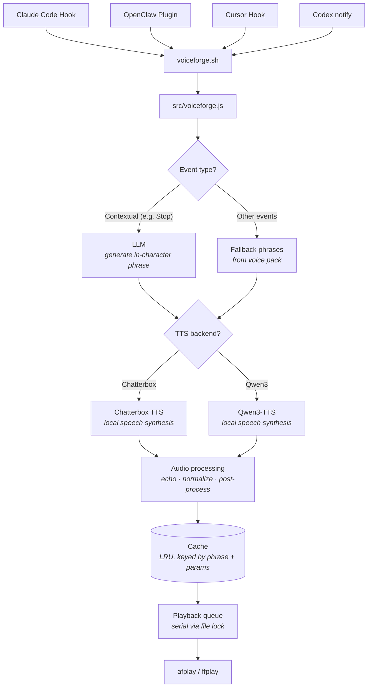

<p align="center">
  <a href="https://youtu.be/-aiSZnGNyE4">
    
  </a>
</p>

<p align="center">
  <a href="https://github.com/settinghead/voiceforge/actions/workflows/cli-integration.yml">
    
  </a>
</p>

# VoiceForge

LLM-generated voice notifications for [Claude Code](https://docs.anthropic.com/en/docs/claude-code), [Cursor](https://cursor.com/docs/agent/hooks), [OpenAI Codex](https://developers.openai.com/codex/), and [OpenClaw](https://openclaw.dev), spoken by game characters like the StarCraft Adjutant, Kerrigan, C&C EVA, SHODAN, and more.

## Why VoiceForge?

Existing notification chimes (like [peon-ping](https://github.com/PeonPing/peon-ping)) do a great job of telling you *when* something happened, but not *what* happened or *which* agent needs your attention. If you have several agent sessions running at once, you end up alt-tabbing through windows just to find the one waiting on you.

VoiceForge makes each session speak in a distinct character voice with its own tone and vocabulary. You hear *"Query efficiency restored to nominal"* from the HEV Suit in one window and *"Pathetic test suite for code validation processed"* from SHODAN in another, and you know immediately what changed. Because phrases are generated by an LLM instead of picked from a tiny fixed set, they stay varied instead of becoming wallpaper.

## Quick Start

### 1. Install prerequisites

| Aspect | macOS | Windows | Linux |
|--------|-------|---------|-------|
| **Node.js 18+** | [nodejs.org](https://nodejs.org) or `brew install node` | [nodejs.org](https://nodejs.org) or `winget install OpenJS.NodeJS` | [nodejs.org](https://nodejs.org) or distro package (for example `sudo apt install nodejs`) |
| **Audio playback** | Built-in (`afplay`) | [FFmpeg](docs/installing-ffmpeg.md) so `ffplay` is on PATH | [FFmpeg](docs/installing-ffmpeg.md) so `ffplay` is on PATH |
| **Audio effects** | [SoX](docs/installing-sox.md) (optional) | [SoX](docs/installing-sox.md) (optional) | [SoX](docs/installing-sox.md) (optional) |

See [Installing FFmpeg](docs/installing-ffmpeg.md) and [Installing SoX](docs/installing-sox.md) for platform-specific commands.

You will also want:

- An **LLM API key** from [OpenRouter](https://openrouter.ai) (recommended), [OpenAI](https://platform.openai.com/api-keys), [Google Gemini](https://aistudio.google.com/apikey), or [Anthropic](https://console.anthropic.com/settings/keys). You can skip this and use fallback phrases only.
- At least one **TTS backend** if you want spoken output instead of notifications only.

| Backend | Best for | Requirements |
|---|---|---|
| [**Qwen3-TTS**](qwen3-tts-server/README.md) (recommended) | Apple Silicon or NVIDIA GPU | Python 3.13+, 16 GB RAM, ~8 GB disk |
| [**Chatterbox**](docs/chatterbox-tts.md) | Any platform with GPU | Python 3.10+, CUDA or MPS |

The setup wizard auto-detects running TTS backends. If none are running yet, setup still completes, but you will only get text notifications and fallback phrases until you start one and rerun setup.

### 2. Install and run setup

```bash
npm install -g @settinghead/voiceforge
voiceforge setup
```

The setup wizard configures:

- LLM provider and API key
- Voice pack downloads
- Active voice pack
- TTS backend
- Platform hooks for Claude Code, Cursor, and Codex

For OpenClaw, install the separate [OpenClaw plugin](docs/openclaw.md).

### 3. Start a TTS backend for spoken voice

Start [Qwen3-TTS](qwen3-tts-server/README.md) or [Chatterbox](docs/chatterbox-tts.md), then run:

```bash
voiceforge setup
```

This lets the wizard detect the backend and store it in config.

### 4. Verify

```bash
voiceforge test "Hello"
```

You should hear a phrase and see a notification. If you do not hear speech, check that:

- A TTS server is running
- `voiceforge config` shows the expected `tts_backend`

> **Visual notifications**: VoiceForge shows a popup with each phrase without extra install. On macOS you can use the custom overlay or system Notification Center. On Windows and Linux you get system toasts. Change it anytime with:
> ```bash
> voiceforge notification
> ```

### From a git clone

Run `npm install` inside `cli/`, then use `node src/cli.js` or link it globally if you prefer. Config and cache live in `~/.voiceforge` (Windows: `%USERPROFILE%\.voiceforge`).

## Development

Run tests locally with:

```bash
npm test
```

For release-impacting changes, add a changeset before opening a PR:

```bash
npm run changeset
```

## Supported Voices

| | Pack ID | Voice | Source | Status |
|---|---------|-------|--------|--------|
|  | `sc1-adjutant` | **SC1 Adjutant** | StarCraft | ✅ Available |
|  | `sc2-adjutant` | **SC2 Adjutant** | StarCraft II | ✅ Available |
|  | `red-alert-eva` | **EVA** | Command & Conquer: Red Alert | ✅ Available |
|  | `sc1-kerrigan` | **SC1 Kerrigan** | StarCraft | ✅ Available |
|  | `sc2-kerrigan` | **SC2 Kerrigan** | StarCraft II | ✅ Available |
|  | `sc1-protoss-advisor` | **Protoss Advisor** | StarCraft | ✅ Available |
|  | `ss1-shodan` | **SHODAN** | System Shock | ✅ Available |
|  | `hl-hev-suit` | **HEV Suit** | Half-Life | ✅ Available |

More coming soon: [Request a voice](https://github.com/settinghead/voiceforge/issues/new?title=Voice+request%3A+%5BCharacter+Name%5D&body=**Character%3A**+%0A**Game%2FSource%3A**+%0A**Why%3A**+)

```bash
voiceforge voice
```

## Integrations

### Claude Code

Installed through `voiceforge setup`. Claude Code hook events are processed by:

```bash
voiceforge hook
```

### Cursor

Installed through `voiceforge setup`, or add hooks manually in `~/.cursor/hooks.json`:

```json
{
  "version": 1,
  "hooks": {
    "sessionStart": [{ "command": "voiceforge cursor-hook", "timeout": 10 }],
    "sessionEnd": [{ "command": "voiceforge cursor-hook", "timeout": 10 }],
    "stop": [{ "command": "voiceforge cursor-hook", "timeout": 10 }],
    "postToolUseFailure": [{ "command": "voiceforge cursor-hook", "timeout": 10 }],
    "preCompact": [{ "command": "voiceforge cursor-hook", "timeout": 10 }]
  }
}
```

| Cursor Hook Event | VoiceForge Event | Category |
|---|---|---|
| `sessionStart` | SessionStart | `session.start` |
| `sessionEnd` | SessionEnd | `session.end` |
| `stop` | Stop | `task.complete` |
| `postToolUseFailure` | PostToolUseFailure | `task.error` |
| `preCompact` | PreCompact | `resource.limit` |

Restart Cursor after installing or changing hooks. See [Cursor integration](docs/cursor.md) for details.

### Codex

VoiceForge uses Codex's `notify` config so that completed agent turns call:

```bash
voiceforge codex-notify
```

`voiceforge setup` can install or update the `notify` entry in `~/.codex/config.toml`. See [Codex integration](docs/codex.md).

### OpenClaw

OpenClaw uses a separate plugin. See [OpenClaw integration](docs/openclaw.md) for installation, config, and troubleshooting.

## Common Commands

```bash
voiceforge setup                  # Interactive setup wizard
voiceforge voice                  # Interactive voice pack picker
voiceforge pack list              # List available voice packs
voiceforge pack show              # Show active pack details
voiceforge pack use <pack-id>     # Switch active voice pack
voiceforge config                 # Show current configuration
voiceforge config set <key> <val> # Set a config value
voiceforge volume                 # Show or change playback volume
voiceforge notification           # Choose popup / system / off
voiceforge test "<text>"          # Run the full pipeline
voiceforge log                    # Stream activity log
voiceforge uninstall              # Remove installed integrations
voiceforge help                   # Show full help
```

## How It Works



1. A hook or notify event fires from Claude Code, Cursor, Codex, or OpenClaw.
2. VoiceForge maps it to an event category and loads the active voice pack.
3. Contextual events such as task completion or tool failure can use the configured LLM to generate a short in-character phrase.
4. Other events use predefined fallback phrases from the pack.
5. The chosen phrase is synthesized by the configured TTS backend.
6. Audio is optionally post-processed, cached, then played through a serialized queue.

## Configuration

Run `voiceforge config path` to find `config.json`. You can edit it directly or use `voiceforge setup` and `voiceforge config set`.

| Field | Type | Default | Description |
|---|---|---|---|
| `enabled` | boolean | `true` | Master on/off switch |
| `llm_backend` | string | `"openrouter"` | LLM provider: `openrouter`, `openai`, `gemini`, `anthropic`, or `local` |
| `llm_api_key` | string \| null | `null` | API key for the chosen LLM provider |
| `llm_model` | string \| null | `null` | Model ID (`null` = provider default) |
| `openrouter_api_key` | string \| null | `null` | Legacy alias used when `llm_backend` is `openrouter` and `llm_api_key` is empty |
| `openrouter_model` | string \| null | `null` | Legacy alias used when `llm_model` is empty and backend is `openrouter` |
| `chatterbox_url` | string | `"http://localhost:8004"` | Chatterbox TTS server URL |
| `tts_backend` | string | `"chatterbox"` | TTS backend: `chatterbox` or `qwen` |
| `active_pack` | string | `"sc2-adjutant"` | Active voice pack ID |
| `volume` | number | `1.0` | Playback volume (0.0-1.0) |
| `categories` | object | — | Per-category enable/disable settings |
| `logging` | boolean | `true` | Activity log in `~/.voiceforge/voiceforge.log` |
| `error_log` | boolean | `false` | Fallback/error log in `~/.voiceforge/fallback.log` |

### Event categories

Event categories apply across Claude Code, Cursor, Codex, and OpenClaw where the corresponding event exists.

| Category | Hook Event | Description | Default |
|---|---|---|---|
| `session.start` | SessionStart | New session begins | on |
| `session.end` | SessionEnd | Session ends | on |
| `task.complete` | Stop | Agent finishes a task | on |
| `task.acknowledge` | UserPromptSubmit | User sends a prompt | off |
| `task.error` | PostToolUseFailure | A tool call fails | on |
| `input.required` | PermissionRequest | Agent needs user approval | on |
| `resource.limit` | PreCompact | Context window nearing limit | on |
| `notification` | Notification | General notification | on |

Omitted categories default to enabled. Set any category to `false` to disable it:

```bash
voiceforge config set categories.task.complete true
voiceforge config set categories.task.acknowledge false
voiceforge config set categories.session.start true
```

### Logging

- Activity logging is on by default and writes one line per event to `~/.voiceforge/voiceforge.log`.
- Error logging is off by default and records fallback situations in `~/.voiceforge/fallback.log`.
- Debug logging for hook sources is written to `~/.voiceforge/hook-debug.log`.

Useful commands:

```bash
voiceforge log
voiceforge log on
voiceforge log off
voiceforge log path
voiceforge log error on
voiceforge log error off
voiceforge log error-path
```

You can also manage configuration interactively with the `/voiceforge-config` slash command in Claude Code.

### Integration behavior

- `voiceforge setup` installs hooks for Claude Code, Cursor, and Codex.
- Re-run setup anytime to add a platform you skipped earlier.
- `voiceforge uninstall` removes Claude Code, Cursor, and Codex integration.
- OpenClaw is managed separately through its plugin.
- The global `enabled` flag disables processing everywhere; there is no separate per-integration toggle in `config.json`.

## Full CLI Reference

```bash
voiceforge setup                  # Interactive setup wizard (LLM, voice, TTS, hooks)
voiceforge hook                   # Process hook event from stdin (Claude Code)
voiceforge cursor-hook            # Process hook event from stdin (Cursor)
voiceforge codex-notify           # Process notify payload from argv (Codex)
voiceforge config                 # Show current configuration
voiceforge config show            # Show current configuration
voiceforge config set <k> <v>     # Set a config value (supports categories.X dot notation)
voiceforge config path            # Print config file path
voiceforge log                    # Stream activity log (tail -f style)
voiceforge log path               # Print activity log file path
voiceforge log error-path         # Print error/fallback log file path
voiceforge log on | off           # Enable or disable activity logging
voiceforge log error on | off     # Enable or disable error logging
voiceforge voice                  # Interactive voice pack picker
voiceforge pack list              # List available voice packs
voiceforge pack show              # Show active pack details
voiceforge pack use <pack-id>     # Switch active voice pack
voiceforge volume                 # Show current volume and prompt for new value
voiceforge volume <0-100>         # Set playback volume (0 = mute, 100 = max)
voiceforge notification           # Choose notification style (popup / system / off)
voiceforge test "<text>"          # Run full pipeline: LLM -> TTS -> audio playback
voiceforge cost                   # Show accumulated token usage and estimated cost
voiceforge cost reset             # Clear the usage log
voiceforge uninstall              # Remove hooks from Claude Code, Cursor, and Codex, optionally config/cache
voiceforge help                   # Show help
voiceforge --version              # Show version
```

## Platform Notes

- **Windows**: Install [Node.js](https://nodejs.org) and [FFmpeg](docs/installing-ffmpeg.md). Ensure the npm global bin directory is on PATH so hooks can find `voiceforge` or `voiceforge.cmd`.
- **Linux**: Install Node and [FFmpeg](docs/installing-ffmpeg.md) so `ffplay` is on PATH.
- **macOS**: Playback uses the built-in `afplay`; install [SoX](docs/installing-sox.md) if you want optional effects and processing.

## Uninstall

```bash
voiceforge uninstall
npm uninstall -g @settinghead/voiceforge
```

This removes VoiceForge hooks from Claude Code, Cursor, and Codex, the `voiceforge-config` skill, and optionally your local config and cache in `~/.voiceforge`.

## Advanced

See [Creating Voice Packs](docs/creating-voice-packs.md) for building your own character voice packs.

## Credits

- **Protoss Advisor** voice pack inspired by [openclaw/protoss-voice](https://playbooks.com/skills/openclaw/skills/protoss-voice)

## License

MIT - see [LICENSE](LICENSE).
