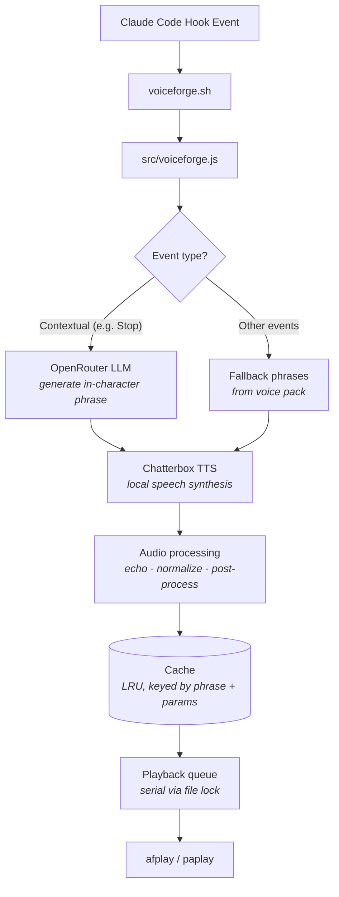

# VoiceForge

Voice packs for [Claude Code](https://docs.anthropic.com/en/docs/claude-code). AI-cloned characters announce task completions, errors, and session events using contextual phrases generated by an LLM and spoken through a local TTS server with voice cloning.

## Voices

| Pack ID | Voice | Source | Status |
|---------|-------|--------|--------|
| `sc1-adjutant` | **SC1 Adjutant** | StarCraft | ✅ Available |
| `sc2-adjutant` | **SC2 Adjutant** | StarCraft II | ✅ Available |
| `red-alert-eva` | **EVA** | Command & Conquer: Red Alert | ✅ Available |
| `sc1-kerrigan` | **SC1 Kerrigan** | StarCraft | ✅ Available |
| `sc2-kerrigan` | **SC2 Kerrigan** | StarCraft II | ✅ Available |
| `sc1-protoss-advisor` | **Protoss Advisor** | StarCraft | ✅ Available |
| `ss1-shodan` | **SHODAN** | System Shock | ✅ Available |
| | **GLaDOS** | Portal | 🔜 Planned |
| | **Cortana** | Halo | 🔜 Planned |
| | **HEV Suit** | Half-Life | 🔜 Planned |
| | **Deckard Cain** | Diablo | 🔜 Planned |

```bash
voiceforge voice    # interactive picker
```

## How It Works



1. Claude Code fires a hook event — `voiceforge.sh` passes it to `src/voiceforge.js`
2. The event is mapped to a category and the active voice pack is loaded
3. Contextual events (e.g. task completion) send context to an OpenRouter LLM, which generates a short in-character phrase; other events use predefined fallback phrases from the pack
4. The phrase is sent to a local Chatterbox TTS server for speech synthesis with per-pack voice cloning parameters
5. The resulting audio is post-processed (optional pitch/tempo), echo-filtered, and volume-normalized (sox)
6. Processed audio is cached on disk — repeated phrases play instantly from cache
7. A file-based queue with lock ensures serial playback across concurrent hook events

## Quick Install

```bash
git clone https://github.com/settinghead/voiceforge.git
cd voiceforge
bash install.sh
```

Then edit `~/.claude/hooks/voiceforge/config.json` to add your OpenRouter API key and voice file.

## Prerequisites

- **macOS** (uses `afplay` for audio; see Linux note below)
- **Node.js 18+**
- **OpenRouter API key** — get one at [openrouter.ai](https://openrouter.ai)
- **Chatterbox TTS server** — local text-to-speech (see setup below)

## Chatterbox TTS Setup

VoiceForge uses [Chatterbox TTS](https://github.com/resemble-ai/chatterbox) for speech synthesis running as a local API server.

### 1. Clone and set up Chatterbox

```bash
git clone https://github.com/resemble-ai/chatterbox.git
cd chatterbox
python3 -m venv venv
source venv/bin/activate
pip install -e .
pip install fastapi uvicorn
```

### 2. Run the server

```bash
python -m chatterbox.server --port 8004
```

### 3. (Optional) Auto-start with launchd (macOS)

Create `~/Library/LaunchAgents/com.chatterbox.tts.plist`:

```xml
<?xml version="1.0" encoding="UTF-8"?>
<!DOCTYPE plist PUBLIC "-//Apple//DTD PLIST 1.0//EN"
  "http://www.apple.com/DTDs/PropertyList-1.0.dtd">
<plist version="1.0">
<dict>
    <key>Label</key>
    <string>com.chatterbox.tts</string>
    <key>ProgramArguments</key>
    <array>
        <string>/path/to/chatterbox/venv/bin/python</string>
        <string>-m</string>
        <string>chatterbox.server</string>
        <string>--port</string>
        <string>8004</string>
    </array>
    <key>WorkingDirectory</key>
    <string>/path/to/chatterbox</string>
    <key>RunAtLoad</key>
    <true/>
    <key>KeepAlive</key>
    <true/>
    <key>StandardOutPath</key>
    <string>/tmp/chatterbox.log</string>
    <key>StandardErrorPath</key>
    <string>/tmp/chatterbox.err</string>
</dict>
</plist>
```

Then load it:

```bash
launchctl load ~/Library/LaunchAgents/com.chatterbox.tts.plist
```

## Voice Reference Setup

Chatterbox clones a voice from a reference WAV file. Place your WAV file in the Chatterbox voices directory and set the filename in `config.json`:

```json
{
  "voice": "my-voice.wav"
}
```

**Note:** Do not commit copyrighted voice samples. Use your own recordings or freely licensed audio.

## Configuration

Edit `~/.claude/hooks/voiceforge/config.json`:

| Field | Type | Default | Description |
|---|---|---|---|
| `enabled` | boolean | `true` | Master on/off switch |
| `openrouter_api_key` | string | `""` | OpenRouter API key for contextual phrases |
| `openrouter_model` | string | `"google/gemini-2.0-flash-001"` | LLM model ID |
| `chatterbox_url` | string | `"http://localhost:8004"` | TTS server URL |
| `active_pack` | string | `"sc-adjutant"` | Active voice pack ID (see `packs/`) |
| `voice` | string | `"default.wav"` | Legacy voice reference WAV filename (overridden by pack) |
| `volume` | number | `1.0` | Playback volume (0.0–1.0) |
| `categories` | object | — | Enable/disable per event category |

You can also use the `/voiceforge-config` slash command in Claude Code to manage configuration interactively.

## CLI

```bash
voiceforge voice                  # Interactive voice picker (arrow keys + enter)
voiceforge pack list              # List available voice packs
voiceforge pack show              # Show active pack details
voiceforge pack use <pack-id>     # Switch active voice pack
voiceforge config                 # Show current configuration
voiceforge config set <key> <val> # Set a config value (supports dot notation, e.g. categories.notification)
voiceforge config path            # Print config file path
voiceforge test "<text>"          # Run full pipeline: LLM -> TTS -> playback
voiceforge cost                   # Show accumulated token usage and estimated cost
voiceforge cost reset             # Clear the usage log
voiceforge help                   # Show help
voiceforge --version              # Show version
```

## Event Categories

| Category | Hook Event | Description | Default |
|---|---|---|---|
| `session.start` | SessionStart | New Claude Code session begins | on |
| `task.complete` | Stop | Claude finishes a task (LLM-generated phrase) | on |
| `task.acknowledge` | UserPromptSubmit | User sends a prompt | off |
| `task.error` | PostToolUseFailure | A Bash tool call fails (LLM-generated phrase) | on |
| `input.required` | PermissionRequest | Claude needs user approval | on |
| `resource.limit` | PreCompact | Context window nearing limit | on |
| `notification` | Notification | General notification | on |

Additional hook events (SessionEnd, SubagentStart) are registered but use the closest matching category.

## Linux Support

VoiceForge prefers `ffplay` (from FFmpeg) for audio playback with echo effects, falling back to `afplay` (macOS). On Linux, install FFmpeg for `ffplay` support, or edit `src/voiceforge.js` to use your preferred player:

```javascript
// In playCached(), replace the afplay fallback with:
// PulseAudio:
spawn("paplay", [cachePath], { stdio: ["ignore", "ignore", "ignore"] });
// PipeWire:
spawn("pw-play", [cachePath], { stdio: ["ignore", "ignore", "ignore"] });
```

## Uninstall

```bash
bash ~/.claude/hooks/voiceforge/uninstall.sh
```

This removes hooks from Claude Code settings and cleans up installed files. You'll be prompted to keep or remove your config and cached audio.

## Advanced

See [Creating Voice Packs](docs/creating-voice-packs.md) for a guide on building your own character voice packs.

## Credits

- **Protoss Advisor** voice pack inspired by [openclaw/protoss-voice](https://playbooks.com/skills/openclaw/skills/protoss-voice)

## License

MIT — see [LICENSE](LICENSE).
