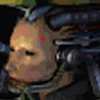
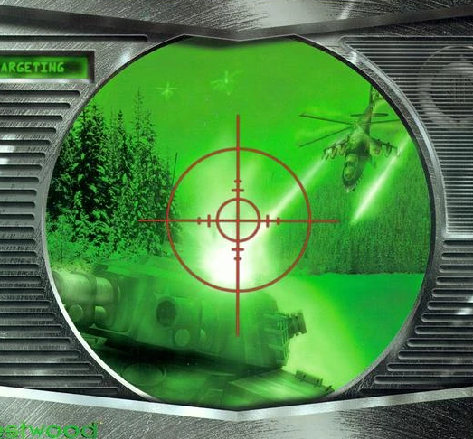
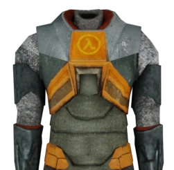
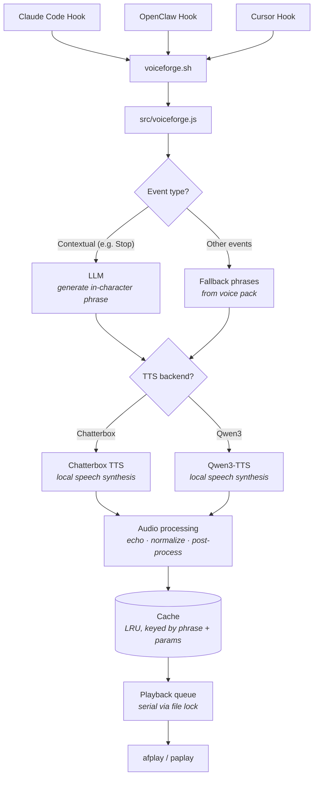

<p align="center">
  <a href="https://youtu.be/-aiSZnGNyE4">
    
  </a>
</p>

# VoiceForge

LLM-generated voice notifications for [Claude Code](https://docs.anthropic.com/en/docs/claude-code), [Cursor](https://cursor.com/docs/agent/hooks), and [OpenClaw](https://openclaw.dev), spoken by game characters like the StarCraft Adjutant, Kerrigan, C&C EVA, SHODAN, and more.

### Why VoiceForge?

Existing notification chimes (like [peon-ping](https://github.com/PeonPing/peon-ping)) do a great job of telling you *when* something happened — a task finished, an error occurred. But when you've got half a dozen coding agent windows running at once, a simple ding doesn't tell you *what* just happened or *which* session needs your attention. You end up alt-tabbing through windows trying to figure out who's waiting on you.

VoiceForge fixes that. Each session speaks to you in a distinct character voice — each with its own personality, tone, and vocabulary — so you hear *"Query efficiency restored to nominal"* from the clinical HEV Suit in one window and *"Pathetic test suite for code validation processed"* from a contemptuous SHODAN in another, and you instantly know what's going on. And because phrases are generated by an LLM rather than pulled from a fixed list, you won't hear the same line on repeat until you want to throw your speakers out the window.


## Voices

| | Pack ID | Voice | Source | Status |
|---|---------|-------|--------|--------|
|  | `sc1-adjutant` | **SC1 Adjutant** | StarCraft | ✅ Available |
|  | `sc2-adjutant` | **SC2 Adjutant** | StarCraft II | ✅ Available |
|  | `red-alert-eva` | **EVA** | Command & Conquer: Red Alert | ✅ Available |
|  | `sc1-kerrigan` | **SC1 Kerrigan** | StarCraft | ✅ Available |
|  | `sc2-kerrigan` | **SC2 Kerrigan** | StarCraft II | ✅ Available |
|  | `sc1-protoss-advisor` | **Protoss Advisor** | StarCraft | ✅ Available |
|  | `ss1-shodan` | **SHODAN** | System Shock | ✅ Available |
|  | `hl-hev-suit` | **HEV Suit** | Half-Life | ✅ Available |


**More coming soon** — [Request a voice](https://github.com/settinghead/voiceforge/issues/new?title=Voice+request%3A+%5BCharacter+Name%5D&body=**Character%3A**+%0A**Game%2FSource%3A**+%0A**Why%3A**+)

```bash
voiceforge voice    # interactive picker
```

## How It Works



1. A hook event fires (from Claude Code, Cursor, or OpenClaw) — `voiceforge.sh` or `voiceforge cursor-hook` passes it to `src/voiceforge.js`
2. The event is mapped to a category and the active voice pack is loaded
3. Contextual events (e.g. task completion) send context to the configured LLM, which generates a short in-character phrase; other events use predefined fallback phrases from the pack
4. The phrase is sent to the configured TTS backend (Chatterbox or Qwen3-TTS) for local speech synthesis with per-pack voice cloning parameters
5. The resulting audio is post-processed (optional pitch/tempo), echo-filtered, and volume-normalized (sox)
6. Processed audio is cached on disk — repeated phrases play instantly from cache
7. A file-based queue with lock ensures serial playback across concurrent hook events

## Prerequisites

| Aspect | macOS | Windows | Linux |
|--------|-------|---------|-------|
| **Node.js** | 18+ | 18+ | 18+ |
| **Audio playback** | Built-in (`afplay`) | [FFmpeg](https://ffmpeg.org/download.html) — `ffplay` on PATH | [FFmpeg](https://ffmpeg.org/) — `ffplay` on PATH |
| **Audio effects** | [SoX](docs/installing-sox.md) (optional) | [SoX](docs/installing-sox.md) (optional) | [SoX](docs/installing-sox.md) (optional) |

See [Installing SoX](docs/installing-sox.md) for platform-specific instructions.

**All platforms**

- **LLM API key** — one of: [OpenRouter](https://openrouter.ai) (recommended), [OpenAI](https://platform.openai.com/api-keys), [Google Gemini](https://aistudio.google.com/apikey), or [Anthropic](https://console.anthropic.com/settings/keys). The setup wizard walks you through this, or skip for fallback phrases only.
- **TTS backend** (at least one):

| Backend | Best for | Requirements |
|---|---|---|
| [**Qwen3-TTS**](#option-a-qwen3-tts-setup) (recommended) | Apple Silicon Macs | Python 3.13+, 16 GB RAM, ~8 GB disk |
| [**Chatterbox**](#option-b-chatterbox-tts-setup) | Any platform with GPU | Python 3.10+, CUDA or MPS |

<details>
<summary><strong>Option A: Qwen3-TTS Setup (recommended for Apple Silicon)</strong></summary>

<a id="option-a-qwen3-tts-setup"></a>

Uses [Qwen3-TTS](https://huggingface.co/Qwen/Qwen3-TTS-12Hz-1.7B-Base) with an MLX backend (quantized, fast on Apple Silicon).

```bash
cd qwen3-tts-experiment
./setup.sh    # creates venv, installs deps, downloads model (~8 GB)
./run.sh      # starts server on port 8100
```

Then set VoiceForge to use it:

```bash
voiceforge config set tts_backend qwen
```

See [`qwen3-tts-experiment/README.md`](qwen3-tts-experiment/README.md) for environment variables, API docs, and troubleshooting.

</details>

<details>
<summary><strong>Option B: Chatterbox TTS Setup</strong></summary>

<a id="option-b-chatterbox-tts-setup"></a>

Uses [Chatterbox TTS](https://github.com/resemble-ai/chatterbox) for speech synthesis running as a local API server.

#### 1. Clone and set up Chatterbox

```bash
git clone https://github.com/resemble-ai/chatterbox.git
cd chatterbox
python3 -m venv venv
source venv/bin/activate
pip install -e .
pip install fastapi uvicorn
```

#### 2. Run the server

```bash
python -m chatterbox.server --port 8004
```

#### 3. (Optional) Auto-start with launchd (macOS)

Create `~/Library/LaunchAgents/com.chatterbox.tts.plist`:

```xml
<?xml version="1.0" encoding="UTF-8"?>
<!DOCTYPE plist PUBLIC "-//Apple//DTD PLIST 1.0//EN"
  "http://www.apple.com/DTDs/PropertyList-1.0.dtd">
<plist version="1.0">
<dict>
    <key>Label</key>
    <string>com.chatterbox.tts</string>
    <key>ProgramArguments</key>
    <array>
        <string>/path/to/chatterbox/venv/bin/python</string>
        <string>-m</string>
        <string>chatterbox.server</string>
        <string>--port</string>
        <string>8004</string>
    </array>
    <key>WorkingDirectory</key>
    <string>/path/to/chatterbox</string>
    <key>RunAtLoad</key>
    <true/>
    <key>KeepAlive</key>
    <true/>
    <key>StandardOutPath</key>
    <string>/tmp/chatterbox.log</string>
    <key>StandardErrorPath</key>
    <string>/tmp/chatterbox.err</string>
</dict>
</plist>
```

Then load it:

```bash
launchctl load ~/Library/LaunchAgents/com.chatterbox.tts.plist
```

</details>

The setup wizard (`voiceforge setup`) auto-detects which TTS backends are running and lets you choose.

## Quick Install

```bash
npm install -g @settinghead/voiceforge
voiceforge setup
```

The setup wizard configures your LLM provider, API key, voice pack, TTS server, Claude Code hooks, and optionally Cursor hooks. Run `voiceforge setup` again anytime to reconfigure.

**From a git clone:** `npm install` in the repo, then run `voiceforge setup`. The `voiceforge` CLI will use the local copy (config and cache go to `~/.voiceforge` when installed globally, or the repo when run via `node src/cli.js`).

> **🔔 Visual notifications** — VoiceForge shows a popup with each phrase (no extra install). On **macOS** you can use a custom overlay or the system Notification Center; on **Windows/Linux** you get system toasts. Turn notifications off or switch style anytime with:
> ```bash
> voiceforge notification
> ```

## OpenClaw Integration

VoiceForge also works with [OpenClaw](https://openclaw.dev). Install the hook with:

```bash
openclaw hooks install openclaw/voiceforge
```

Or from inside a Claude Code / OpenClaw session, just ask your agent:

> Install the VoiceForge OpenClaw hook from `openclaw/voiceforge` in the voiceforge repo

| OpenClaw Event | VoiceForge Event | Category |
|---|---|---|
| `command:stop` | Stop | `task.complete` (LLM-generated phrase) |
| `command:new` | SessionStart | `session.start` |
| `command:reset` | SessionStart | `session.start` |
| `message:received` | UserPromptSubmit | `task.acknowledge` |

Configuration is shared with VoiceForge — run `voiceforge setup` to configure. To uninstall: `voiceforge uninstall`. To remove only the OpenClaw hook, delete `~/.openclaw/hooks/voiceforge`.

## Cursor Integration

VoiceForge works with [Cursor](https://cursor.com/docs/agent/hooks) Agent (Cmd+K / Agent Chat). Install hooks during setup:

```bash
voiceforge setup
```

When prompted **"Install Cursor hooks?"**, choose **Yes** to register VoiceForge in `~/.cursor/hooks.json`. Restart Cursor for hooks to take effect.

Or add the hooks manually to `~/.cursor/hooks.json`:

```json
{
  "version": 1,
  "hooks": {
    "sessionStart": [{ "command": "voiceforge cursor-hook", "timeout": 10 }],
    "sessionEnd": [{ "command": "voiceforge cursor-hook", "timeout": 10 }],
    "stop": [{ "command": "voiceforge cursor-hook", "timeout": 10 }],
    "postToolUseFailure": [{ "command": "voiceforge cursor-hook", "timeout": 10 }],
    "preCompact": [{ "command": "voiceforge cursor-hook", "timeout": 10 }]
  }
}
```

| Cursor Hook Event | VoiceForge Event | Category |
|---|---|---|
| `sessionStart` | SessionStart | `session.start` |
| `sessionEnd` | SessionEnd | `session.end` |
| `stop` | Stop | `task.complete` (LLM-generated when transcript available) |
| `postToolUseFailure` | PostToolUseFailure | `task.error` (LLM-generated from error message) |
| `preCompact` | PreCompact | `resource.limit` |

Configuration is shared with VoiceForge at `~/.voiceforge/config.json` (or `voiceforge config path`). Restart Cursor after installing or changing hooks. For a detailed reference and troubleshooting, see [Cursor integration](docs/cursor.md).

## Configuration

Configuration lives at `config.json` (run `voiceforge config path` to find it). You can edit it directly or use `voiceforge setup` / `voiceforge config set`.

| Field | Type | Default | Description |
|---|---|---|---|
| `enabled` | boolean | `true` | Master on/off switch |
| `llm_backend` | string | `"openrouter"` | LLM provider: `openrouter`, `openai`, `gemini`, `anthropic`, or `local` |
| `llm_api_key` | string | `""` | API key for the chosen LLM provider |
| `llm_model` | string | `""` | Model ID (empty = provider default) |
| `openrouter_api_key` | string | `""` | Legacy alias — used when `llm_backend` is `openrouter` and `llm_api_key` is empty |
| `openrouter_model` | string | `""` | Legacy alias — used when `llm_model` is empty and backend is `openrouter` |
| `chatterbox_url` | string | `"http://localhost:8004"` | Chatterbox TTS server URL |
| `tts_backend` | string | `"chatterbox"` | TTS backend: `chatterbox` or `qwen` |
| `active_pack` | string | `"sc2-adjutant"` | Active voice pack ID (see `packs/`) |
| `volume` | number | `1.0` | Playback volume (0.0–1.0) |
| `categories` | object | — | Enable/disable per event category |
| `logging` | boolean | `true` | Activity log: one line per event to `~/.voiceforge/voiceforge.log` (retention: 30 days or 5MB, whichever comes first) |
| `error_log` | boolean | `false` | Error/fallback log: when LLM fails or no context, append to `~/.voiceforge/fallback.log` |

### Logging

- **Activity log** (default **on**): Each hook event is written as one line to `~/.voiceforge/voiceforge.log`. Retention is 30 days or 5MB total, whichever is reached first (oldest lines are dropped). Run `voiceforge log` to stream the log live (tail-style). Turn off with `voiceforge log off`, on with `voiceforge log on`.
- **Error log** (default **off**): When the LLM is not used or fails (no context, timeout, API error), VoiceForge uses a fallback phrase; if **error log** is enabled, a line is appended to `~/.voiceforge/fallback.log`. Only contextual events (Stop, PostToolUseFailure) produce entries. Turn on with `voiceforge log error on`, off with `voiceforge log error off`. Paths: `voiceforge log path` (activity), `voiceforge log error-path` (error).

You can also use the `/voiceforge-config` slash command in Claude Code to manage configuration interactively.

## CLI

```bash
voiceforge setup                  # Interactive setup wizard (LLM, voice, TTS, hooks)
voiceforge hook                   # Process hook event from stdin (Claude Code)
voiceforge cursor-hook            # Process hook event from stdin (Cursor)
voiceforge voice                  # Interactive voice picker (arrow keys + enter)
voiceforge pack list              # List available voice packs
voiceforge pack show              # Show active pack details
voiceforge pack use <pack-id>     # Switch active voice pack
voiceforge config                 # Show current configuration
voiceforge config set <key> <val> # Set a config value (supports dot notation, e.g. categories.notification)
voiceforge config path            # Print config file path
voiceforge log                    # Stream activity log (tail -f style)
voiceforge log path               # Print activity log file path
voiceforge log error-path         # Print error/fallback log file path
voiceforge log on | off           # Enable or disable activity logging
voiceforge log error on | off     # Enable or disable error logging
voiceforge test "<text>"          # Test full pipeline: LLM generates in-character phrase, TTS synthesizes speech, then plays audio
voiceforge cost                   # Show accumulated token usage and estimated cost
voiceforge cost reset             # Clear the usage log
voiceforge help                   # Show help
voiceforge --version              # Show version
```

## Event Categories

Event categories apply to Claude Code, Cursor, and OpenClaw where the corresponding hook exists.

| Category | Hook Event | Description | Default |
|---|---|---|---|
| `session.start` | SessionStart | New session begins | on |
| `session.end` | SessionEnd | Session ends | on |
| `task.complete` | Stop | Agent finishes a task (LLM-generated phrase) | on |
| `task.acknowledge` | UserPromptSubmit | User sends a prompt | off |
| `task.error` | PostToolUseFailure | A tool call fails (LLM-generated phrase) | on |
| `input.required` | PermissionRequest | Agent needs user approval | on |
| `resource.limit` | PreCompact | Context window nearing limit | on |
| `notification` | Notification | General notification | on |

Additional hook events (e.g. SubagentStart) are registered in Claude Code but use the closest matching category.

## Platform notes

- **Windows**: Use `npm install -g @settinghead/voiceforge`, then `voiceforge setup`. Configure Cursor/Claude Code hooks to call `voiceforge hook` / `voiceforge cursor-hook` if your environment doesn’t pick them up automatically. Audio needs FFmpeg (`ffplay`) on PATH. Notifications use **node-notifier** (included).
- **Linux**: Same as Prerequisites table. Audio: `ffplay` on PATH. Notifications use **node-notifier** (included).

## Uninstall

```bash
voiceforge uninstall
```

This removes VoiceForge hooks from Claude Code and Cursor, the voiceforge-config skill, and optionally your config and cache (`~/.voiceforge`). To remove the CLI as well:

```bash
npm uninstall -g @settinghead/voiceforge
```

## Advanced

See [Creating Voice Packs](docs/creating-voice-packs.md) for a guide on building your own character voice packs.

## Credits

- **Protoss Advisor** voice pack inspired by [openclaw/protoss-voice](https://playbooks.com/skills/openclaw/skills/protoss-voice)

## License

MIT — see [LICENSE](LICENSE).
